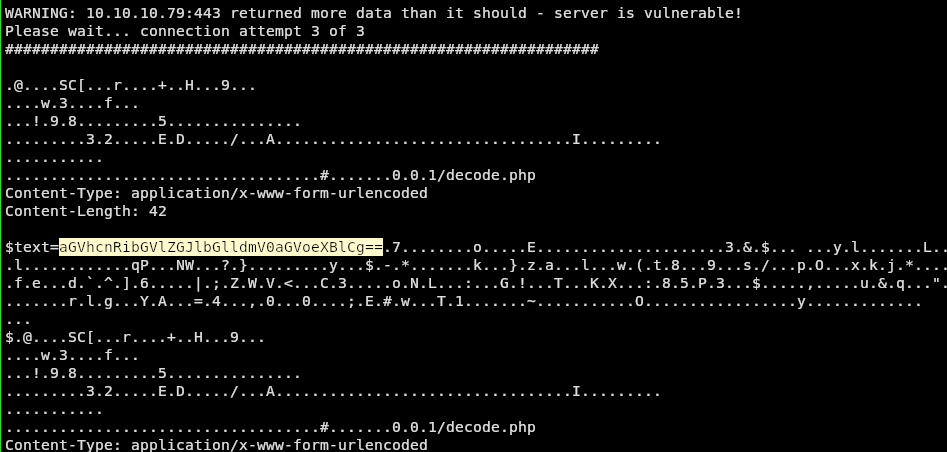

# 💟 Valentine

## Enumeration

Ports Opened : 80;443;22

```
nmap --script vuln -p 443 10.10.10.79 -Pn -v
```

```
PORT    STATE SERVICE
443/tcp open  https
|_http-csrf: Couldn't find any CSRF vulnerabilities.
|_http-vuln-cve2017-1001000: ERROR: Script execution failed (use -d to debug)
|_http-stored-xss: Couldn't find any stored XSS vulnerabilities.
| ssl-poodle: 
|   VULNERABLE:
|   SSL POODLE information leak
|     State: VULNERABLE
|     IDs:  CVE:CVE-2014-3566  BID:70574
|           The SSL protocol 3.0, as used in OpenSSL through 1.0.1i and other
|           products, uses nondeterministic CBC padding, which makes it easier
|           for man-in-the-middle attackers to obtain cleartext data via a
|           padding-oracle attack, aka the "POODLE" issue.
|     Disclosure date: 2014-10-14
|     Check results:
|       TLS_RSA_WITH_AES_128_CBC_SHA
|     References:
|       https://www.openssl.org/~bodo/ssl-poodle.pdf
|       https://www.imperialviolet.org/2014/10/14/poodle.html
|       https://cve.mitre.org/cgi-bin/cvename.cgi?name=CVE-2014-3566
|_      https://www.securityfocus.com/bid/70574
|_http-dombased-xss: Couldn't find any DOM based XSS.
| ssl-heartbleed: 
|   VULNERABLE:
|   The Heartbleed Bug is a serious vulnerability in the popular OpenSSL cryptographic software library. It allows for stealing information intended to be protected by SSL/TLS encryption.
|     State: VULNERABLE
|     Risk factor: High
```

We see that its vulnerable to heartbleed bug.

We search and download the exploit

[https://gist.github.com/eelsivart/10174134](https://gist.github.com/eelsivart/10174134)

We put the necessary arguments like -n 100 ( running 100 times)

&#x20;then at the starting of the out put we see&#x20;

<figure><figcaption></figcaption></figure>

## Initial Foot Hold

now we decode&#x20;

```
echo aGVhcnRibGVlZGJlbGlldmV0aGVoeXBlCg== | base64 -d
```

we get "heartbleedbelievethehype"

Lets Save it

After Dir brute forcing we see that there is hype\_key.txt in /dev/ and there is an ssh key so we&#x20;

```
ssh -i hype_key.key hype@10.10.10.79
```

IF ENCOUNTERS THIS ERROR "sign\_and\_send\_pubkey: no mutual signature supported"But the best solution is create a new private key and upload the public key to each server one by one, because when you got this error, means your private key is deprecated to use.

```
# vim ~/.ssh/config, add the lines at the beginning
Host *
    PubkeyAcceptedKeyTypes=+ssh-rsa
    HostKeyAlgorithms=+ssh-rsa
```

OR

```
ssh -o PubkeyAcceptedKeyTypes=ssh-rsa -i {yourfile} user@host
```

We see that we have been an pass key so we paste the decoded text from above

\--------------------------------------------We are In---------------------------------------------------------------&#x20;

## Privileged Escalation&#x20;

We Run linpeas and found that its vulnerable to dirty cow

So we search github dirty cow / download it and run it and get the root user

## ALTERNATIVE&#x20;

&#x20;by running

```
history
```

We see that there is command `tmux -S /.devs/dev_sess`

Then By running&#x20;

```
ps -ef | grep root
```

We see that that proccess is running in root and that file location has as group named hype which we have access to

Meaning we can have root access by running that tmux session
